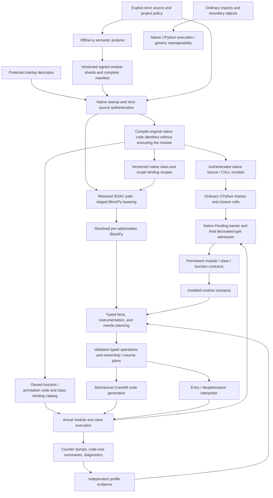

# Module Lifecycle

This document tracks the current high-level SOAC module pipeline and the crate
dependencies that own each stage. The dependency graph below is generated from
the workspace's normal dependencies. Build dependencies, dev-dependencies used
only for test fixtures, crates with no remaining visible dependency edges, and
cross-cutting helper crates are intentionally omitted.

## End-to-end dataflow

The current enforcement milestone follows the ordinary-CPython branch, with
lowering, BlockPy caches and JIT entry counters all zero. The retained SOAC
branch must still honor every installed contract; its optimization/profile
arrows describe existing machinery, not current deliverables. Optimization and
benchmarks require a separate request after enforcement is complete.

The profile arrow represents a deliberate restart, not adaptive learning in
the apply process. The capability arrow does not mean class execution waits
for its own seal: module initialization can use checked generic paths, and
later calls can use capabilities published by completed construction. Failure
to qualify for an optimization cannot revoke an installed language contract.

## Strict module path

The type-driven implementation is in progress. The current path separates
authenticated logical proposals from actual installed runtime policies:

1. The standalone pinned `tools/ty` executable analyzes source without importing
   it. `soac_contracts` owns schema-6 / strict-contract-2 proposals, schema-2 deployment descriptors,
   source/dependency fingerprints, signatures, and complete-generation
   verification. Selected strict sources have explicit logical-name/canonical-file
   ownership in both resolver directions; ordinary dependencies retain normal
   stub resolution. Its output is not an optimized runtime capability.
2. Native startup reads the out-of-band deployment descriptor before Python
   code runs. `soac_jit::strict_loading` independently verifies the actual
   interpreter, ABI, artifact generation, source bytes, and observed inputs.
3. The CPython backend enters `soac_jit::strict_interpreter` before any lowering.
   `create_interpreter_module` compiles the authenticated original source and
   validates native code/source/CALL receipts. Its separate native module state
   hands the globals owner to the actual module dictionary and consumes the
   root code for one initialization attempt. `exec_interpreter_module` executes
   ordinary CPython frames; callbacks bind actual function objects, closure
   cells, class namespaces, evaluated call operands, and source-store results.
   Neither names nor a matching dictionary grants execution authority. There is
   no BlockPy module, compiler function ID, optimization plan, or JIT entry on
   this path. Diagnostics record actual source/generation ownership and original
   code entry, independently of the three compilation counters.
4. On the retained SOAC branch, `soac_lowering` retains verified source identities and explicit callable
   roles. Generated function-creation sites have a compiler-owned node sidecar;
   generated annotation providers have explicit target identities. Name binding
   materializes closure construction, and strict class construction becomes a
   `ConstructClass` operation before typed planning/codegen.
   Calls in a class scope also retain an explicit namespace operand through
   typed IR and serialization. The native call boundary uses actual builtin
   identity to read the explicit class namespace mapping without substituting
   callable objects or inheriting the surrounding interpreter frame.
   Native compile data also carries exact code and lexical-slot identities,
   class entry initializers, semantic comprehension bindings, original
   source accesses, child captures, and namespace exports. Code nodes retain
   their actual native first line, including decorators. Capture creation
   distinguishes original source ranges from the native class-annotation
   body-completion marker; only the exact direct-provider relation authorizes
   the latter. Construction flags come from the same canonical exports and
   are checked, not reconstructed from generated cell names. The interpreter
   backend validates these relationships while ordinary CPython frames own
   execution and cleanup. Retained SOAC class bodies select actual class lexical
   cells, incoming FREE bindings and namespace exports. Eager comprehensions
   use ordinary helper scopes and their own iteration cells; they do not need
   a native frame-slot projection or an omitted-slot proof. Scope schema7
   retains semantic source, touched-carrier, capture and access identities for
   independent source/annotation authentication, without restore inventories,
   restoration-completeness flags or execution schedules. The separate original-code
   Store/CALL table remains necessary to authenticate actual CPython definition
   publication and call sites; it does not prescribe SOAC execution. Class entry
   initializers follow actual parameter/slot kinds and FREE ordinals, not
   `COPY_FREE_VARS`/`MAKE_CELL`/`RESUME` opcode matching. Metadata collection
   grants no execution entry.
   Generator resume errors retain an explicit normalized-raise disposition.
   `SourceNormalized` marks injection at a source operation;
   `PropagateNormalized` marks forwarding. Both preserve an already-normalized
   exception without adding context chaining. Original source ranges remain
   ordinary instruction metadata, not traceback sites or observer events.
   Archive, CFG and inline validation preserve the semantic disposition for
   both JIT and entry execution.
5. The JIT and entry interpreter call the same strict construction runtime.
   A single-use namespace argument binds each invocation, and its active
   environment carries the creation identity into new methods/providers.
   Same-source functions from a different class execution are not owned targets.
   Both source execution branches pass an authenticated Pending construction
   handle to native CPython. The actual type has its allocation and destination
   `__class__` barrier before callbacks, while preserving ordinary dictionaries
   and requested slots. Source ownership is active; final Self/own-field
   targets bind only to the selected decorated type. A slots replacement gets
   its own linked Pending state. Admission installs mandatory constraints and
   seals metadata before enabling instances. Only an unselected original with
   no permanent type contract may become dynamic; independently installed
   method-metadata and inherited policies remain. Unsupported classes decline before
   participating construction. A source fact or layout alone is not a frozen
   method target. During the original unopened Pending bind, Rust registers
   `prepare_storage_state` through `PyType_SetSoacStorageStateFactoryV1` before
   the first allocating bind callback. This write-once factory registration
   does not prepare an instance or open its allocation barrier.
6. Per-execution module/class/function state uses GC-visible owners. Required
   class admission occurs at the actual final class binding, separately from
   module sealing. Required field targets bind before instance admission; no
   function parameter/return targets are installed or snapshotted per call.
   Module finalization drains weak adoption records and publishes only verified
   sealed objects. A second weak drain publishes optional field/method witnesses
   after pending classes have sealed, including actual nominal operands needed
   by independently guarded sites. Neither drain retains all targets at once;
   publication only fills absent slots.
   Sealed globals can outlive their module wrapper; detached instance
   dictionaries retain their projected storage rules and required nominal
   targets, not a receiver or unrelated slot-target backedge.
7. Public strict function entries preserve ordinary argument binding, results
   and exceptions. They perform no function-level type enforcement, on any
   backend. In retained SOAC machinery, guarded field loads, method-family
   lookup and `TypedSourceCallPlan` independently authenticate their receiver,
   actual callable and body. The source call plan contains arity/target facts,
   not checked-argument nominations or return proofs. A source-selected fixed
   target requires equality with the actual activation's pinned body. Direct
   and virtual paths preserve binding, defaults, recursion and cleanup. General
   direct/inline plans still cannot bypass strict source ownership.

The retained SOAC compiled and entry-interpreter backends execute their own
resolved IR through their existing source-owned entries. They authenticate the actual
function and source owner, capture invocation identity, complete ordinary
argument binding, and retain safe activation/closure cleanup. No parameter,
return or generated-factory-result type checks remain. The legacy
unchecked-target identity remains zero for strict functions. Public vectorcall
replacement does not require a separate native source-entry registration.
Private implementation metadata is checked against its owning destructor before
any payload read. Each invocation captures owning Rust handles and the actual
source identities before callbacks; permitted metadata replacement cannot free
the template or environment of an invocation already running. This allocation-
type guard is separate from authenticated source and contract authority.

The 2026-08-24 and 2026-08-25 (PDT) scope amendments remove the parallel
reference-token executor and SOAC-specific traceback/frame reconstruction.
There is no synthetic native frame, locals-plus projection, source-parent
frame link, or frame-retention proof in either retained SOAC backend.
Source identities/ranges still authenticate construction and diagnostics.
Exception propagation/chaining, evaluation order, explicit callbacks,
comprehension scoping, suspension and required cleanup remain mandatory.
Transient reference counts and implicit-finalizer schedules may differ.

Ordinary imports retain their original CPython loader and receive no SOAC
optimization metadata. A path allow-list only limits which imports ask the
native loader for admission; it does not authorize transformation. Copying a
strict code object, future flag, source name, or globals dictionary likewise
does not grant a native execution entry.

Automatic class eligibility is established before irreversible native type
installation. Ordinary standard-library dataclasses can keep dictionaries,
requested slots, frozen behavior, descriptors, and replacement-class identity.
Unknown framework/metaclass/decorator behavior remains dynamic instead of
receiving a partial sealed layout. Nominal field predicates, physical field
layout, method-family slots, and fixed callable targets are independent
capabilities. Optional field checking requires its own enforced write policy;
an annotation is not a storage or presence proof.

After final type admission, supported fresh allocation may obtain immutable
`PyTypeState` from the actual type's existing GC-owned `tp_cache`. Native code
checks exact state/type/version receipts before reuse. Cold preparation holds
the real MRO across the registered Rust factory, which resolves actual declaring
owners and creates independent dictionary-only and native-member projections.
Native construction validates their complete owner/index/name/offset catalogue
and rechecks allocation eligibility after callbacks. It never overwrites a
foreign cache or performs callback-capable invalidation in `PyType_Modified`.

The fresh allocator reserves and initializes the optional trailer and its
per-object marker before reference tracing or publication. Inline dictionary
writes use those prepared rules; native materialization attaches the shared
dictionary-only state to the new exact dictionary before exposing it. Escaped
dictionary writes use direct checked state access, with no receiver lookup or
per-write MRO discovery. Per-attachment lifecycle flags remain separate from
the immutable shared rules, so one dictionary's teardown does not revoke a
sibling's policy.

This protocol initially covers the audited 64-bit little-endian GIL layout,
tested on Linux AArch64, with default fixed-size GC heap instances and fresh
exact dictionary materialization. Ordinary allocation sizes stay unchanged;
stateful dictionaries bypass ordinary freelists, and raw reference helpers
preserve the object-flag half while updating the low `u32` count. Existing or
replacement dictionaries retain their actual identity and prior allocation.
Custom/variable-size allocators, mixed legacy/factory families and unversionable
types retain legacy enforcement, not a retrofitted trailer or weaker inherited
contract. Source/Rust promotion is complete; the fresh optimized build and
real-checker integration validation remain pending at this 2026-08-25 (PDT)
checkpoint. This representation change grants no new layout/dispatch capability.

See [the type-driven specification](TYPE_DRIVEN_OPTIMIZATION.md),
[specialization status](SPECIALIZATION.md), and the
[implementation evidence ledger](optimization-attempts/2026-08-21-type-driven-strict-contracts.md)
for the remaining interpreter-enforcement, compatibility, and full-gate work.
Benchmarks and new optimization remain deferred until separately requested.

## Lowering and pre-optimization representation

`soac_pyo3::jit_runtime::create_module` authenticates the actual bytes and
compiles the original code catalog, then calls
`soac_driver::source_to_blockpy` with verified type facts and canonical native
annotation strings. The catalog preserves source identity without eagerly
evaluating lazy annotation providers.

`CanonicalClassBindings` is the value-only, source-bound decoding of the
native compiler's optional class metadata. It is not executable authority.
`ClassBindingScope` and its validated storage projection preserve actual
CELL/FREE ownership, dictionary-first lookup, child captures and exported
class cells. They do not construct an inspectable execution frame.
The authenticated declaration identity retains decorators, whose expressions
execute in the containing activation rather than the class namespace body.

Closure creation distinguishes the logical cell needed by a nested function
from the callee's incoming carrier name. A lexical owner/capture `CellReference`
resolves in the creating frame's scope, including when that frame originally
received its cell from a native class carrier. An explicit construction cell
retains its selected carrier when the source name is not a lexical cell.
`CellObject` remains the explicit native
namespace projection; resolving it as the argument's own storage would create
a different cell.

Native class-child capture transport preserves the source's dictionary-first
lookup decision. The original child code's complete freevar inventory resolves
class-local shadowing versus an outer captured fallback; transformed lexical
inference cannot add a public capture. A source name that shares a cell's
physical or logical spelling still uses its explicit dictionary-first lookup.
Compiler-only cell value projections remain separate from these source reads.

Native binding metadata is completed from the compiler's final CELL/FREE maps
before CFG assembly. Annotation code generation can append implicit FREE
entries after scope entry; completing those metadata rows does not renumber
native operands or relax original localsplus and lexical binding validation.

Function, lambda and class comprehensions use ordinary comprehension
lowering, including async and tuple-target forms. They do not require native
inlined-local inventories or current/saved frame-slot joins. The first
iterable executes in the containing scope; iteration bindings remain isolated,
named expressions keep their selected outer bindings, and dictionary keys
precede values. Actual lexical cells and suspended operand ownership remain
explicit. Class namespace bindings retain their independently required
source-bound cell initialization, accesses, captures and exports; no table
needs to cover native iteration slots. Frame correspondence grants no admission
authority.

A lambda whose expression needs helper definitions keeps its original
`ExprLambda` creation site, parameters, defaults and source identity. The
private `LoweredLambdaBody` holds its rewritten statement body, first in the
rewrite context and then in semantic state. One deterministic node namespace
covers both visible syntax and stored bodies. Scope analysis and the existing
class-cell/static-attribute/`super()` visitors inspect that actual body; module
planning emits it in the lambda's own callable scope. Defaults still execute
at the containing expression, while helpers capture the lambda's parameters
when it is called. This is compiler syntax, not a runtime frame projection or
an admission proof, and adds no public crate API or serialized IR field.
The same lexical rewrite visits nested-definition decorators and defaults in
their containing scope, then rewrites each lambda body with that lambda's own
first parameter. Zero-argument `super()` therefore uses the actual lexical
class cell and receiver, including in a lambda created by a nested default;
it does not recover either operand from an execution frame.

`TakeOperand` transfers a compiler expression owner and clears
its slot without cloning it. `ComprehensionInsert` borrows the collection root
while consuming owned inputs using exact native container semantics. The
shared physical-role validator excludes lexical, class namespace/cell
and control owners from takes, and forbids consuming a borrowed container
inside its insertion operation. These effects survive lowering explicitly;
they are not inferred again from Python helper-call shapes in codegen.

`OperandLocation` distinguishes active local storage from preserved suspension
storage. Both require an explicit compiler Operand role; lexical cells and
source locals never acquire that role merely by being preserved. Generator
factories pass the same ordered preserved-role indices into their real capsule
and resume layout. These slots start NULL. Capsule destruction releases live
operands newest-first before local cleanup, including
when a suspended activation never resumes; recursive clearing cannot skip ahead
to the local owners. This is SOAC's cleanup convention, not a CPython
instruction-level lifetime contract.

Augmented assignment moves its captured old value into the in-place operation;
an intervening `await` moves that same owner into suspended storage. It does not
clone an operand and leave a second mandatory delete behind. Delegation's
StopIteration classification, value extraction, and error forwarding use
`Preserve` handled-state context: these are compiler operations, not Python
`except` suites. Compiler cleanup does not invent a Python handler; actual
source handlers retain their ordinary entry and restoration behavior.

Source-ordered expanded calls use `BuildCollection`, `CallArgumentOp`, and
`PreparedCall`. Expansion/merge happens in the original phase, not when the
eventual call is emitted: a sole starred iterable is normalized after keyword
evaluation, and a group of named keywords is evaluated before its merge.
Prepared invocation takes the existing exact tuple/dict once. `IteratorStep`
borrows the actual loop Operand and preserves pending exhaustion for the
explicit loop continuation; it does not rewrite the user-visible `next` builtin.
SOAC leaves ordinary callback exceptions intact without adding reconstructed
frames or source-position events. The 2026-08-25 (PDT) amendments exclude
SOAC frame inspection and CPython-compatible observer coverage, including
mandatory refusal. No observer scope, reservation or enablement barrier is
required for SOAC execution. Ordinary CPython frames and observers are unchanged.
Actual source ownership and construction/mutation checks remain independent
requirements, as do recursion safety and internal SOAC counters and logs.
Outgoing calls borrow their evaluated operands through the existing contextual
vectorcall, then consume the SOAC-owned input slots on either outcome. They do
not reproduce CPython's transient argument-reference counts or require a
parallel native-token entry.

CPython's ordinary inlined calls retain the evaluator choice made at their
original pre-binding predicate. Keyword/default binding can execute Python and
change the hook; that change affects later dispatch, not the already selected
default entry. Generic handlers carry the choice as a C local. Specialized
frame pushes retain their existing pre-producer guard, whose producer ordering
is validated by the cases generator. No pointer witness is stored on the
Python stack, and this dispatch choice grants no strict source-body authority.

`soac_lowering::driver` records the following passes:

| Stage | Resolved responsibility |
| --- | --- |
| Parse and `ast-to-ast` | Validate original tokens and supported syntax; check strict source identity; preserve declaration/header ranges while rewriting source constructs. |
| `core_blockpy_with_await_and_yield` | Replace source control flow and definitions with structured compiler operations. Raw names are still unresolved. |
| `core_blockpy_with_yield` | Lower `await` into the explicit delegation protocol. |
| `core_blockpy` | Lower suspension into internal resume bodies and preserved storage, keeping lexical cells distinct from activation state. |
| `name_binding` | Resolve local, global, cell, free, and preserved locations and explicit closure construction. |
| `global_index` | Assign logical global-binding positions; runtime stability/presence still require their own proof. |
| `bb_prepared` | Resolve exception edges, handled-region context, and producer-owned operand cleanup, including preserved generator operands. |
| `blockpy` | Hoist constants, resolve strict `ConstructClass` operations, prepare constructor entries, assign semantic instruction IDs, and validate the CFG. |

The result is a `BlockPyModule<BlockPyModuleShape>`, not machine code or a
sealed runtime object. `soac_core` owns the shared module/storage identities;
`soac_ir_blockpy` owns the resolved instruction vocabulary.

Ownership planning distinguishes successful exit from possible exceptional
prefixes. A key or earlier call argument may fail before a later `TakeOperand`;
exception cleanup therefore keeps all possibly acquired owners and reads
their physical nullable slots. A successful take remains unbound on the normal
edge. Nullable facts also account for the interval after a take and before a
same-slot rebind, so cold cleanup cannot reuse a stale non-null proof.

The driver supports a versioned pre-optimization cache for inspection and
tooling. **Strict imports bypass the writable cache** and lower freshly
verified source. A matching source/build hash on arbitrary serialized IR is
not independent authentication of executable instructions. Cache-format
changes invalidate old layout/identity representations instead of guessing
missing metadata.

## Facts, profile evidence, and typed rewrites

`soac_driver::typed_runtime::prepare_typed_v3_runtime_module_with_rewrites`
infers value facts, converts to `TypedBlockPyModuleShape`, applies mode-selected
typed instrumentation, annotates facts, lowers truth tests, invokes the rewrite
callback, and synchronizes facts with the resulting IR. `soac_instrument`
owns counter definitions and instrumentation; `soac_opt` owns analyses and
rewrites, while `soac_ir_typed` owns typed operations and v3 plan data.

`soac_jit::jit::typed_pipeline` combines that preparation with the actual
runtime registry and authenticated strict proposals. Profile mode preserves
the relevant original call graph for collecting evidence. Apply and verify
consume prior observations and build resolved call/field/scalar decisions.
Source-owned strict calls are excluded from legacy unchecked direct/inlining
candidates. A `TypedSourceCallPlan` records source/body proposals and arity,
not value-type proofs. Its invocation path retains ordinary binding, the actual
callee environment, source/body guards, ownership cleanup, and untouched fallback.

`ModuleOptimizationPlanV3` and function/region decisions describe selected
operations, guards, representations, and exits. They are compiler plans, not
deployment authority. The production runtime consumes raw profile evidence;
there is no required serialized optimization-plan file between profile and
apply. Inspection tools can render plans and post-rewrite IR without making
those artifacts executable.

Production builds a `SpecializationProfile` object even when it has no counter
dump. Passing `None` to a low-level optimizer helper skips shared typed
rewrites, including expression linearization; it is not a faithful substitute
for production `SOAC_OPT_MODE=none` in a regression test.

Source-selected strict facts are intersected with actual installed runtime
capabilities. A successful nominal field check does not imply an exact builtin,
machine-width range, participating strict receiver, stable field presence, or
trusted override. Retained guarded operations need independent evidence valid
through their dependent effects; annotations and completed calls supply no
runtime value proof.

## Ownership, exceptions, and native emission

`soac_opt::passes` computes local-environment, ownership, and resume plans.
`soac_jit::jit::planning` resolves their physical block parameters, stack
mirrors, cleanup roots, exception transport, and deoptimization captures.
`JitModulePlan` and its per-function plans are validated against the typed IR
before `jit/mod.rs` and the backend emit Cranelift operations.

Source locals use SOAC activation ownership, independently of temporary
operands. Producer-selected assignment operands have explicit exceptional cleanup IR.
Typed linearization marks its newly allocated expression operands separately:
dead operands are not inherited as handler roots merely because a predecessor
could have bound them. Live successor operands, explicit block arguments, and
hidden typed-plan inputs remain available. MUST-bound facts justify unchecked
loads; MAY-bound ownership obligations independently determine cleanup.

The shared IR owned-call predicate identifies distinct physical `TakeOperand`
inputs and fresh call results. Within the actual source activation, late typed
linearization keeps an already selected complete call intact. It must not turn
its last argument into a borrowed temporary load and thereby lose the consuming
runtime boundary. This predicate does not admit a callable or infer ownership
from source-local spellings; native scope and callable checks remain separate.

Handled-exception context, pending raised exceptions, closure cells, and
suspended activation state remain explicit across edges. Cleanup must release
each owned reference once and preserve finalizer-visible exception state.
Deoptimization reconstructs the exact supported continuation rather than
replaying completed effects; its buffer must distinguish boxed Python objects
from scalar representations and acquired references from borrowed mirrors.
SOAC traceback/frame inspection and observer compatibility are outside this
milestone; ordinary CPython execution retains its own frame and observer behavior.

Runtime helpers in `soac_jit_runtime` stay raw and ABI-shaped. The entry
interpreter and native emission use the same resolved construction and strict
boundary operations; interpreter execution is not permission to skip them.
`SharedModuleState`, `ModuleRuntime`, and actual `FunctionEnv` values connect
compiled code to one live module/function execution. Source IDs and function
addresses alone are not permanent capabilities.

Compiler-created suspended helpers still need code objects of the correct
native generator/coroutine family, including when their closure is empty.
They reuse the existing family-specific code factory when compatible original
code is absent. This is native object-construction safety, not a requirement
to project source frames, materialize inspectable locals, or match frame layouts.

After a module initializer succeeds, `exec_module_inner` completes strict
adoption and sealing. Failed initialization terminates that execution rather
than retrying it through an unauthenticated loader. Native mutation barriers
remain active for the lifetime of sealed objects, including operations through
ordinary Python, warmed CPython bytecode, and supported C APIs.

## Artifacts and evidence

| Artifact | Meaning and trust boundary |
| --- | --- |
| `tools/ty` output `objects/<digest>.soac-types`, `<generation>/manifest.json`, and `<generation>/modules/…` | Validated, signed, complete offline proposals. Public artifacts are not their own trust anchor. |
| Protected startup deployment descriptor | Out-of-band module policy, public trust anchor, generation, interpreter, dependency, and observed-input expectations. Signing seeds remain outside artifact output. |
| `$SOAC_WORK_DIR/modules/{project,python-stdlib}/…/mod.blockpy` | Inspectable pre-optimization cache with source/build metadata; not accepted as strict executable authority. |
| `$SOAC_WORK_DIR/profile.bin` | Profile observations for a subsequent independently started apply/verify process. Regenerate for each compiler revision. |
| `$SOAC_WORK_DIR/verify.bin` | Optional countered diagnostic execution of selected optimizations, not headline throughput. |
| `$SOAC_WORK_DIR/events.jsonl` | Module-load, planning, runtime hit/fallback, and other configured diagnostic events. |
| `$SOAC_WORK_DIR/jit-code-summary.jsonl` and optional JIT maps/dumps | Emitted function sizes and native attribution evidence; detailed block maps are opt-in. |
| `work/pyperformance/` | Fixed stock/strict source selections, authenticated worker execution, per-round measurements, coverage, and comparison reports. |

Counter flushing is registered at extension initialization; JIT code and
module diagnostics have their own owners and teardown paths. Missing artifacts
are reported as missing, not replaced with inspector-only or ordinary-Python
runs. The acceptance protocol is [OPT_GOAL.md](../OPT_GOAL.md): independently
trained strict apply, the same stock interpreter, at least three alternating
rounds for a final claim, every fixed benchmark result, and evidence that the
meaningful hot code actually executed under sealed strict authority.

## Crate Dependency Graph

The standalone Graphviz source lives at
[`doc/crate_dependencies.dot`](crate_dependencies.dot), and the rendered SVG is
[`doc/crate_dependencies.svg`](crate_dependencies.svg).

Development-only fixture dependencies currently omitted from this graph:
`soac_instrument -> soac_lowering` and `soac_opt -> soac_lowering`. Hidden
helper crates: `soac_config` and `soac_macros`.
