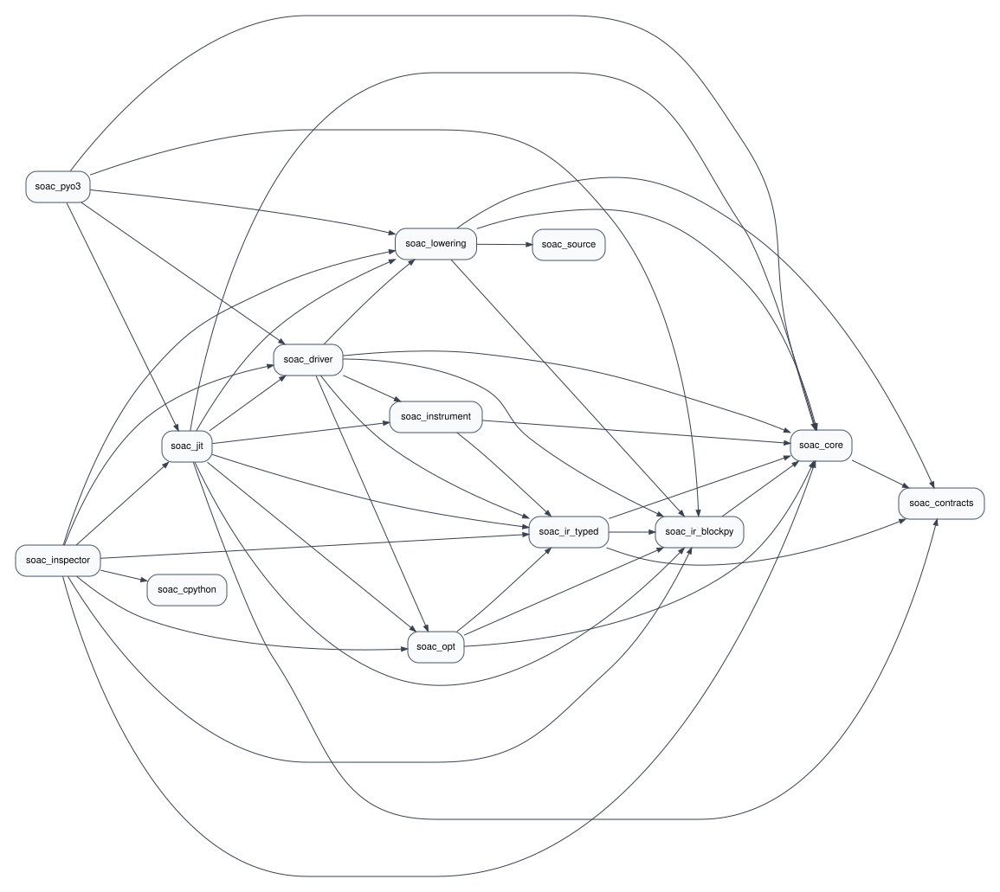

# Module Lifecycle

This document tracks the current high-level SOAC module pipeline and the crate
dependencies that own each stage. The dependency graph below is generated from
the workspace's normal dependencies. Build dependencies, dev-dependencies used
only for test fixtures, crates with no remaining visible dependency edges, and
cross-cutting helper crates are intentionally omitted.

## Crate Dependency Graph

The standalone Graphviz source lives at
[`doc/crate_dependencies.dot`](crate_dependencies.dot), and the rendered SVG is
[`doc/crate_dependencies.svg`](crate_dependencies.svg).

Development-only fixture dependencies currently omitted from this graph:
`soac_instrument -> soac_lowering` and `soac_opt -> soac_lowering`. Hidden
helper crates: `soac_config` and `soac_macros`.
