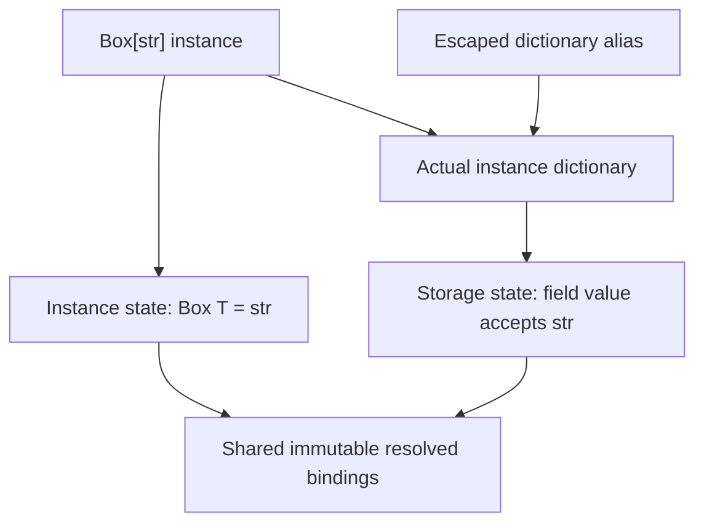

# Storage-owned runtime type state

Design evaluation — 2026-08-24 (PDT).

This evaluation accompanies [Type-Driven Runtime Contracts](TYPE_DRIVEN_OPTIMIZATION.md).
The 2026-08-25 (PDT) amendment to that spec and [OPT_GOAL.md](../OPT_GOAL.md)
selects the optional storage-owned pointer representation for existing
interpreter enforcement. The broader generic design below remains a proposal;
it is not all required by that amendment. The normative allocation requirements
are in [Optional storage-owned runtime type state](TYPE_DRIVEN_OPTIMIZATION.md#optional-storage-owned-runtime-type-state).
No code, native ABI, checker behavior, or benchmark was changed or exercised
for this document. Source observations describe the evaluation-time working
tree, including its in-progress implementation, not a certified runtime build.

## Recommendation

Use an immutable, native-owned **`PyTypeState` attached to the object whose
state is constrained**. For instance-dictionary contents, that object is the
dictionary. For list elements it is the list. For native instance slots it is
the instance. The state bundles resolved write rules, actual generic arguments,
and the native operations that interpret those rules. Many objects may share
one immutable state; this does not require allocating one metadata object per
instance.

Do not make `PyTypeObject` the sole authority for these constraints. It can
still describe class-wide schemas, allocation and storage access, and retain
its existing class-construction/finality state. Those are genuinely per-type
concerns. The distinction is **class schema versus a particular object's
effective contract**, not a prohibition on using the type machinery.

| Question | Recommended answer |
|---|---|
| Where do concrete constraints live? | On the affected storage, with immutable shared metadata and explicit generic substitutions. |
| Does every mutable/generic object need a new metadata allocation? | No. Ordinary objects reserve no state-pointer slot; participating allocations add a pointer and may share immutable state. A per-object bit indicates slot presence. |
| Can every write become `setindex(object, index, value)`? | Only after resolving actual storage and proving that the operation is a plain storage write. Use typed logical locations, not one unqualified integer. |
| What about `list.append`? | It writes the list's homogeneous element role, independent of position. Validate at its underlying storage commit. |
| How does an argument check validate `list[str]`? | Match the actual container implementation and its installed, live generic contract against the expected contract. Checking `Py_TYPE` or scanning contents alone is insufficient. |
| Can the checker report escaped-dictionary errors? | Yes, for known storage provenance and keys, using a field-sensitive constrained mapping type. Unknown aliases still require runtime enforcement. |
| Should strict `__class__`/MRO mutation be prohibited? | Yes. The current native source already has these guards for installed strict ancestry and pending-type admission. |

This direction addresses the real ownership issue. A performance improvement
is plausible from removing repeated policy discovery, but is not established
by counting a flag and a pointer load. No speedup is claimed here.

## 1. What the current implementation actually does

The current design is not simply a flag followed by a global lookup keyed by
instance identity:

* `PyHeapTypeObject.ht_soac_contract` directly references native type state.
  `soac_type_state` and `soac_type_contract` load that pointer and distinguish
  pending state from a published permanent contract.
* `_PySOAC_CheckInstanceWrite` obtains state from `Py_TYPE(instance)`, checks
  protected names, and invokes the installed callback where appropriate.
* Ordinary inherited field policies can require MRO traversal in
  `soac_type_ordinary_dictionary_contract` and `instance_storage_owners`.
  The Rust callback routes through storage owners and field-name collections;
  `StrictFieldChecks::check` ultimately looks up a name in a `BTreeMap` before
  evaluating the selected predicate.
* Materialized dictionaries already have their own native-owned policy.
  `PyDict_SoacPolicyCallback` is a rejecting mutation barrier, not a watcher.
  Its owner is a strong, GC-visible edge of the exact dictionary.

The worthwhile simplification is to resolve a write's effective rules once
at construction/storage attachment, and pass the selected rule to the commit
barrier. Merely relocating the existing callback pointer to `PyTypeObject`
does not eliminate field selection, inherited obligations, or dictionary
ownership.

Nor should the existing type-side state be deleted wholesale: it also
implements pending construction, allocation restrictions, finality, protected
lookup, and class lifetime. Per-storage value checks are one responsibility,
not a replacement for all of that machinery.

### The escaped-dictionary case

Conceptually, with checked fields enabled:

```python
class Box[T]:
    value: T

box = Box[str]("hello")
storage = box.__dict__
del box
storage["value"] = 1       # must still reject
```

The dictionary cannot recover its contract from a dead receiver. Keeping the
receiver alive merely to find its type changes object lifetime. Keeping only
the class alive also fails to distinguish `Box[str]` from `Box[int]`.

The dictionary therefore owns a state describing its field rules with `T`
resolved to the actual runtime `str` target. It need not own `box`. It retains
only the metadata and actual type objects needed by those rules. A self-type
constraint may necessarily retain its class; that is different from retaining
the class as an unnecessary lookup intermediary.

Storage identity also matters on `__dict__` replacement: if replacement is
supported, validate and protect the new dictionary before attachment, while
the escaped old dictionary retains its old protection. If a dictionary is
shared by two receivers, its effective policy must satisfy both obligations,
or attachment must reject. Never replace the first owner's policy with the
second owner's policy. Conflicting invariant specializations should initially
reject, rather than grow an implicit intersection-contract system.

Inline managed dictionaries have not yet become separate dictionary objects.
Their instance must own the applicable state until materialization. The actual
dictionary must receive the corresponding state before it escapes, without
changing the policy or introducing a reverse reference to the receiver.

## 2. `__class__`, bases, and MRO: what is already protected?

**The proposed prohibition is already present in the inspected native source
for objects with installed strict ancestry.** It is stronger than merely
checking whether the old and new layouts are compatible:

| Boundary | Current source behavior |
|---|---|
| Instance `__class__` assignment | `_PySOAC_CheckClassAssignment` rejects if either old or new actual type has a contract anywhere in its MRO. There is no same-layout or same-type exemption in this guard. |
| Pending type | Allocation checks also reject `__class__` reassignment into a pending type before admission. |
| `__bases__` assignment | `_PySOAC_CheckTypeBases` rejects changes to installed strict classes, changes that discard strict ancestry, and attempts to acquire it through base reassignment. |
| MRO publication/recomputation | `_PySOAC_CheckTypeMro` guards the actual resulting MRO, including custom MROs and transitive strict ancestry. Initial construction cannot hide an inherited strict contract. |
| Ordinary control | Unrelated ordinary objects and automatically dynamic classes do not become frozen merely because a strict annotation accepts them. |

`object_set_class` checks before audit callbacks, and
`object_set_class_world_stopped` checks again before changing the actual type.
The regression tests include `setattr`, `object.__setattr__`, direct descriptor
calls, `PyObject_SetAttr`, and `PyObject_GenericSetAttr`, as well as base and
custom-MRO cases. These were read, not rerun for this document.

Retain this rule in the proposed design. A generic contract must also survive
ordinary aliases: any newly participating generic instance must reject
identity/layout changes that could detach its state, even if its class did
not previously have a strict class contract. That extension is not established
merely by the existing class-level guard.

There remains an important boundary:

```python
class OrdinaryA: pass
class OrdinaryB: pass

item = OrdinaryA()
# Suppose a protected list accepts item under nominal OrdinaryA.
item.__class__ = OrdinaryB
```

Freezing the list or a strict `Box` does not freeze an ordinary object stored
inside it. Similarly, a mutable ordinary target class can change its hierarchy.
To promise permanent element membership, either require stable nominal leaves,
add separately approved protection to those referents/hierarchies, or validate
at reads and publish only a checked-read result. Do not silently freeze
ordinary referents just because they were inserted. For `list[str]`, establish
the admitted builtin/subclass membership premise; do not generalize that proof
to arbitrary user-defined classes or to exact `str` representation.

Direct native writes such as arbitrary `Py_SET_TYPE`/struct manipulation remain
outside this supported mutation boundary. The guards are not a defense against
unrestricted native memory writes.

## 3. What `PyTypeState` contains

The following is a conceptual representation, not a proposed public C ABI:

```text
PyTypeState
    schema_identity       # authenticated definition and storage domain
    generic_bindings      # scoped parameter IDs -> resolved runtime contracts
    write_rules           # field, element, key/value, deletion policies
    read_guarantees       # what this state actually proves, and for which ops
    operations            # native validation and contract-projection functions
    interpreter_identity  # where retained runtime type bindings are valid
```

The logical contract is immutable after activation. A storage attachment has
its own prepared/active/terminal lifecycle; destroying one list must not mark
its shared `PyTypeState` terminal for every other list. These transitions may
make an attachment unavailable, but never turn active or failed protection
into unconstrained storage. Construction authority must be native-owned, not
a writable Python attribute or a caller-provided function pointer.

Concrete arguments are **runtime contract descriptors**, not necessarily
`PyTypeObject *` values: `T` may be `str | None`, `list[str]`, or a tuple shape.
Use an immutable normalized graph. Canonical identity includes actual runtime
type bindings, not only source names: two executions of one class factory can
produce distinct nominal targets.

Parameter keys must include their defining scope and position. A field on
`Base[T]`, a field on `Derived[U]`, and a method-local `T` cannot share a binding
just because their names coincide. Pre-resolve inherited substitutions and
preserve every independently inherited write obligation. A conflicting diamond
must reject or have an explicitly designed composition rule.

### Object state and storage projections

An instance may need a generic environment for method argument/return checks,
while its dictionary needs a field-write policy. These can share a binding
graph, but they are not interchangeable check subjects:



There is deliberately no state-to-instance backedge. The dictionary's state
does not make the dictionary a `Box[str]`; its boundary type remains a mapping
with a field-sensitive write policy. Slot and dictionary projections may be
different, particularly when a slot hides an identically named dictionary key.

The type object's own immutable class namespace can likewise have storage
state. That is state for the **class object**, not one generic specialization
shared by every instance of that class.

### Where the pointer goes

Selected representation — 2026-08-25 (PDT): only participating allocations
reserve a `PyTypeState *` slot. An audited per-object bit identifies that
allocation form, so an ordinary dictionary/list of the same Python type has
neither an extra null-pointer slot nor a descriptor allocation. Mutability or
generic syntax alone does not require state on every ordinary object.

Prefer an aligned allocation trailer, reached through a checked type-aware
accessor. Preserve existing object/GC prefix offsets; do not use a universal
negative offset, wrapper, replacement Python type, universal header pointer,
or identity-table lookup as the new canonical storage-state representation.
The bit records slot existence through initialization and destruction, not
just whether checking is active. Share immutable state without sharing each
attachment's lifecycle.

For exact dictionaries/lists the pointer extends the object allocation, not
the separately allocated entries/items. A future tuple pointer follows the
variable-length item array without becoming an element. User-instance and
managed-inline-dictionary extensions need their complete audited allocation
layout. Extended allocations need matching GC/free handling and separate
freelist treatment. On a 64-bit build the pointer is eight bytes before
allocator rounding; exact Python type identity is not a binary-ABI guarantee.

An existing object without a slot cannot gain one by changing a flag. Reserve
the extension during supported construction; preserve current enforcement
and explicitly track any legacy late-attachment cases during migration.
See the [normative allocation requirements](TYPE_DRIVEN_OPTIMIZATION.md#optional-storage-owned-runtime-type-state),
which supersede this evaluation's former open placement alternatives.

GC traversal must see every retained type/contract edge. Tuple GC untracking,
freelists, partial allocation failure, teardown and resurrection all need
explicit treatment. Static or immortal objects shared across interpreters
cannot retain arbitrary interpreter-local type arguments. Shared metadata must
not become an unbounded global cache keeping user classes alive forever.

## 4. Two interfaces, not one ambiguous typecheck

There are two different questions:

1. **May this storage operation commit?** The storage's installed state owns
   the rule.
2. **Does this value satisfy the expected type?** The receiving parameter,
   field, or return contract owns the expectation.

Do not let a value assert that it matches an arbitrary expected type by
providing its own unchecked predicate. Its authenticated state supplies
evidence; the expected contract decides what evidence is required.

Conceptually:

```text
validate_write(state, storage, resolved_location, operation, incoming) -> status
match_value(expected_contract, value, binding_environment) -> acceptance/error
```

Native return conventions should distinguish mismatch from internal/error
states, preserve an existing exception, and reject before the forbidden write.
Any acceptance describes precisely what was proved: nominal membership,
protected container contents, or a particular checked producer. It is not
automatically permission for direct layout access or unchecked native code.

### Indexed fields are a useful case, not a universal assumption

For a previously resolved ordinary field, the final operation can indeed be:

```text
store_checked(instance, FieldId(schema, foo), 1)
    -> validate_write(actual_storage.state, actual_storage, field_location, SET, 1)
    -> commit to the already selected storage
```

But a logical field ID is not necessarily the current hash-table slot,
managed-dictionary index, or byte offset. Dictionary resizing and different
storage layouts must not change the meaning of the rule. Pair IDs with their
schema/owner; an integer from another class must not select a valid rule by
accident.

`x.foo = value` must first preserve ordinary attribute resolution. It can call
a property setter or custom descriptor, hit a native slot, or modify an inline
or materialized dictionary. A setter may coerce input or do something other
than store it. Do not bypass it or reject its raw input against a storage rule
before the legitimate conversion occurs. Only the selected plain-storage
commit can use the direct indexed route.

Similarly, `d[key] = value` must preserve hashing/equality, canonical-key
selection and their exceptions. Select the rule using the actual resolved
stored key, without calling those hooks a second time. A non-string key can
compare equal to a field name; a source-name-only shortcut is unsound.

Represent the location as a tagged native record rather than overloading an
integer:

| Resolved location | Example | Rule selected |
|---|---|---|
| `Field(schema, field_id)` | Plain `x.foo = v` | That actual field's rule |
| `Element` | `xs.append(v)` or `xs[i] = v` | Homogeneous list element rule |
| `MappingEntry(resolved_key)` | `d[k] = v` | Key/value rules, plus any field-map rule |
| `TupleItem(position)` | Private tuple construction | Positional or repeated element rule |
| `SetMember` | `s.add(v)` | Set element rule |

Deletion and clearing are operations, not “write a null Python value”. Removing
an element preserves an element-type invariant, while removing a required
namespace binding may violate a different contract. Field deletion also has
its own approved missing/uninitialized semantics.

Resolution, checking and commit need one auditable protocol. A private
resolved-write token is one option, but it must be invalidated/rechecked after
callbacks, storage replacement or resizing. The validator should avoid Python
callbacks and coercion; native mutation still has hashing, iteration, watchers
and reference-release callbacks to order correctly. Publish valid storage
before decref/finalizer effects can inspect it. Free-threaded operation requires
the same synchronization for policy and contents; a pointer load alone is not
a transaction.

## 5. Lists and other non-attribute mutations

`list.append` checks the list's **element contract**, not an attribute on the
list and not the runtime type of the list object itself:

```text
append(xs, value):
    resolve xs's actual native storage
    if xs has active state:
        validate_write(xs.state, xs, Element, APPEND, value)
    append using the ordinary ownership and failure conventions
```

For an exact protected `list[str]`, all aliases use this same state, including
ordinary-Python callers, saved bound methods, `list.append(xs, value)`, and
supported C APIs. A `str` subclass is accepted under nominal element semantics;
an integer is not. Accepting one string-subclass value does not make
`list[StrSubclass]` acceptable as `list[str]`: the containers remain invariant.
An overridden operation on a list subclass requires a
separate producer/consumer contract. Its backing array's invariant alone cannot
prove that an arbitrary overridden `__getitem__` returns a string.

### Required mutation coverage

| Operation family | Obligation |
|---|---|
| `append`, `insert`, indexed assignment | Validate the candidate at the authoritative insertion/replacement seam. |
| `extend`, slice assignment, `+=`, repeated `__init__` | Validate every newly stored element through all fast paths. Define partial-progress and exception behavior explicitly. |
| `clear`, deletion, `pop`, removal | Preserve state even when empty. Reentrant finalizers must not see unprotected storage. |
| Sort, reverse, in-place repetition | Preserve the invariant and state while retaining existing callback/temporary-storage semantics. |
| Comprehensions, builders, deserialization | No publication before initial contents and state are valid. |
| CPython specialized bytecodes, tier executors, retained SOAC paths | Use the barrier or deopt before a raw write; method hooks alone do not cover these. |
| Native APIs and inline helpers | Audit the actual storage write and its error/refcount contract. |

The current `_STORE_SUBSCR_LIST_INT` writes directly to the item array.
`_CALL_LIST_APPEND`, `LIST_APPEND`, and native list implementations reach
`_PyList_AppendTakeRef`. These are concrete bypasses to cover, not hypothetical
calls through `tp_setattro`.

Avoid promising transactionality for every bulk mutation. For example, a
streaming `extend` can retain a valid prefix before encountering an invalid
item, just as iteration can fail after partial progress. Never store the bad
item. Buffering the entire iterable would change memory use and observable
iteration behavior. Slice and mapping operations need their own commit rules,
including key hashing/equality and reentrancy; share the validation mechanism,
not an invented universal bulk-operation semantic.

### The native error-channel limit

`PyList_SetItem` reports failure and steals its input reference even on error.
Any new rejection must preserve that convention. `PyList_SET_ITEM` is an inline
void store intended for filling new lists; it cannot cleanly propagate a
recoverable contract exception to its caller. The
[CPython list C API](https://docs.python.org/3.15/c-api/list.html) documents these
different contracts.

For a first supported implementation, restrict unchecked initialization helpers
to private, not-yet-published construction. Validate before activation. For an
already protected list, use fallible mutation APIs; reject/adapt unsupported
extension paths before granting them access. Merely setting an exception in a
void helper is not a sound substitute. Old inlined stores cannot be repaired
by changing a runtime symbol. If these boundaries cannot be enforced, do not
publish permanent contents guarantees for objects exposed to them.

This is a documented native compatibility restriction, not a claim that
arbitrary existing C extensions become safe automatically.

## 6. Installing generic state at construction

Class definition establishes a **schema with parameters**. Construction
establishes a **substitution for one object**. Neither the class's mutable
attributes nor a thread-local “current generic arguments” variable is suitable
authority for that substitution.

For a fresh object selected by authenticated strict code:

```text
offline checker selects list[str] at this construction site
    -> loader resolves actual type leaves without evaluating annotations
    -> native construction receives explicit resolved state
    -> allocate storage with state/private initialization status
    -> validate initial writes
    -> expose only a valid, actively protected result
```

Literal construction and comprehensions need source-bound construction facts,
not a requirement to spell every constructor as `list[str](...)`. The normal
order of evaluating source expressions must remain intact. Propagate context
only through a recognized fresh allocation; a contextual annotation must not
silently retag an arbitrary object returned by a function.

For a user generic such as `Box[str]`, install enough state before `__init__`
or any other user callback can write fields or expose the instance. A custom
`__new__` can return an existing object, a different type, or publish the object
early. Arbitrary custom `__new__`, including inherited custom allocation, is
excluded from the initial protected-construction protocol. Only default and
explicitly audited builtin/adapter allocation paths participate; do not drop
already installed or inherited restrictions. Do not call arbitrary `__new__`
normally and attach metadata afterward while claiming its earlier writes were
protected. Missing generic
arguments must resolve through the authenticated construction/call environment
or remain unsupported, not be guessed from the first value inserted.

Ordinary Python deliberately erases generic parameters during builtin object
creation; a parameterized alias is not an enforcement mechanism.
[PEP 585](https://peps.python.org/pep-0585/)
In this checkout, `ga_call` and `ga_vectorcall` call the origin first and then
attempt `__orig_class__` assignment. That attribute is too late, mutable, and
not available on all objects. It is never runtime contract authority.

### Existing objects and aliases

```python
ordinary = ["hello"]
alias = ordinary
a: list[str] = ordinary
alias.append(1)
```

A one-time scan cannot make the last line safe. Protecting `ordinary` changes
the allowed behavior of `alias`; wrapping or copying it changes identity or
aliasing. There is no zero-consequence choice.

Recommended initial policy:

* Fresh recognized construction can acquire the selected permanent contract.
* An already protected object must have a compatible installed contract.
* An unprotected existing mutable object cannot silently acquire a durable
  generic guarantee at assignment or argument entry. Require an explicit
  checked copy or a separately specified in-place adoption operation.

Adoption, if added, must validate existing contents and atomically install the
policy, including nested storage and reentrancy. It visibly restricts every
existing alias and is irreversible. Copying is not automatically a deep fix:
an outer copy containing ordinary mutable inner lists still has unprotected
children. Do not offer adoption as a side effect of `match_value`.

A state is not widened/narrowed when the container becomes empty, is assigned
to another variable, or is passed through `Any`. A new object may deliberately
receive a different contract. Specify copy, slice, concatenation, repetition,
factory, and pickle behavior: same-domain copies/slices can retain the source
contract; a mixed result needs a newly selected contract or remains dynamic.
Deserialization must resolve current authenticated identities and validate;
it must never deserialize trusted native pointers or callbacks.

## 7. Tuples: generic metadata without mutation

Tuples do need a way to describe generic structure if we want reusable runtime
evidence. But an immutable value need not have **one uniquely correct generic
specialization**:

```python
("hello",)   # satisfies tuple[str], tuple[object], tuple[str | None], ...
()           # satisfies tuple[T, ...] for every admissible T
```

Represent fixed tuples as positional contracts and `tuple[T, ...]` as a
homogeneous contract, with length checked separately. A pointer can cache such
structural evidence; it must not turn a broader immutable view into a forbidden
retagging operation. In particular, do not mutate CPython's shared empty tuple
to mean `tuple[str, ...]` for one caller and `tuple[int, ...]` for another. Give
it canonical empty-shape semantics or validate it structurally without stored
specialization. Other shared constants need the same discipline.

An immutable tuple can be checked structurally when no state exists: it has no
future element replacement to guard. That does not solve recursively mutable
contents. A `tuple[list[str], ...]` still requires protected inner lists for a
durable nested guarantee, and ordinary nominal elements can still change type.
Cache only facts whose supporting premises remain valid.

Thus “a state slot for tuples” is reasonable; “every tuple must be stamped
with the exact type arguments of its first use” is not.

## 8. Value matching with generic parameters

The expected type is a structured descriptor, conceptually:

```text
Nominal(actual_runtime_type, allow_subclasses)
Applied(origin, argument_contracts)
TupleShape(positional_contracts | repeated_contract)
Union(alternatives)
Parameter(scoped_parameter_id)
```

Keep three operations separate:

1. **Validate a type expression:** supported origin and arity, fully resolved
   parameter references, admissible bounds/constraints/defaults, valid variance,
   recursion limits, and complete authenticated identities.
2. **Validate a value now:** test it against the expected resolved descriptor.
3. **Establish a continuing guarantee:** prove that its admitted operations and
   storage prevent that descriptor from becoming false, or require checked reads.

A non-null state pointer is not an answer to all three. Neither is Python's
`isinstance(value, list[str])`: ordinary Python does not provide that generic
runtime check. Keep the SOAC matcher separate from public `isinstance` unless
changing that builtin is independently requested.

For a parameter declared `list[str]`, after ordinary argument binding:

1. Confirm actual list membership and that the implementation's relevant
   operations are covered. Initially prefer exact lists; an arbitrary subclass
   does not inherit proof of its overridden producers.
2. Obtain its actual, active, interpreter-owned storage-state attachment. A
   missing, pending, forged, or terminal attachment supplies no protected-container proof.
3. Project that state to the expected origin. For user classes this follows
   authenticated generic base substitutions, not just `issubclass`.
4. Compare arguments using the expected origin's variance and the runtime
   contract relation. For mutable `list`, require invariant compatibility.
5. Return only the supported acceptance capability. Do not scan and attach
   new state as a hidden effect of argument validation.

For non-generic nominal leaves, use actual native type/subtype tests, as the
current `strict_checks::is_type` does. Do not execute user
`__instancecheck__`, a spoofed `__class__`, arbitrary annotation code, or generic
alias hooks to obtain authority. Numeric widening remains distinct from exact
representation and must not accidentally make mutable numeric containers
covariant.

Identical canonical descriptors can make matching cheap; otherwise compare
the structured contracts. Equality of generic *spelling* is insufficient.
An empty protected `list[int]` still fails `list[str]`; a protected
`list[str | int]` fails even if its current elements happen to be strings.
Union matching is a pure disjunction over whole contracts: `list[str] |
list[int]` is not the same contract as `list[str | int]`. Never try union
alternatives by mutating the object until one passes.

Nested generics require recursively enforceable evidence. Reject unsupported
recursive contracts initially; later graph traversal needs visited-pair
tracking and bounded validation, not infinite recursion. A TypeVar bound is
not its concrete binding. Resolve one consistent call substitution, respecting
its constraints, and reuse it for all occurrences and the result. An
unconstrained empty container cannot uniquely solve a call's TypeVar.

### Instance parameters versus call parameters

```python
class Box[T]:
    def replace(self, value: T) -> None: ...
    def convert[U](self, value: U) -> U: ...
```

`replace` gets `T` from the receiver's immutable state. `convert` gets `T` from
that state and `U` from a separate per-call substitution after normal binding.
Do not mutate the shared function's contract for each receiver or retain the
last call's `U` on the class/instance. Bound methods and direct unbound calls
must both identify the actual receiver. A checked return uses the same
substitution captured for that activation.

Future generator/coroutine support would need to retain this environment across
suspension and check yields, sends and completion at their actual boundaries;
the current synchronous checking scope does not already provide that contract.

## 9. Variance and gradual typing

Variance governs substitution between **parameterized interfaces**. It does
not let an alias rewrite the object's installed write rules. Python's typing
specification distinguishes invariant mutable generics from covariant and
contravariant interfaces; declarations and inferred variance must be validated
by the checker, not trusted from writable runtime attributes.
[Typing specification: generics](https://typing.python.org/en/latest/spec/generics.html#variance)

For a sound subtype relation `S <: T`, the proposed runtime contract rules are:

| Expected interface | Argument relation | Why |
|---|---|---|
| Read/write `list[T]` | Invariant: source argument equivalent to `T` | Reads produce `T`; writes accept `T`. Neither direction alone is sufficient. |
| Proven read-only `Sequence[T]` | Covariant: source produced type `<: T` | Caller only consumes produced values through this interface. |
| Proven consumer `Sink[T]` | Contravariant: `T <: source accepted type` | Source must accept everything the caller may supply. |
| Checked `Callable[[A], R]` | Contravariant in `A`, covariant in `R` | Input acceptance and result guarantees run in opposite directions. |
| Fixed immutable tuple | Covariant per position, compatible shape | There is no element-replacement input position. |

For example, admitting a protected `list[str]` as `list[object]` would let a
statically valid `append(1)` fail inside that callee. The runtime barrier
prevents corruption, but this does not justify calling it a sound mutable
subtype. Reject the incompatible boundary. A read-only view can instead expose
strings as objects while the original list retains its string-only writes.
Such a view does not itself make arbitrary lists or arbitrary `Sequence`
implementations protected: require the actual producer contract, not merely
ABC registration. A `list[str]` viewed as a sequence still rejects integer
insertion through any other alias.

Runtime variance checking must use capabilities, not just annotations. A
putative covariant class with unchecked producing overrides is not a proven
producer. A contravariant consumer that advertises accepting `object` but
actually rejects non-strings is not a proven `Sink[object]`. Generic inherited
methods/fields require substitution before these comparisons.

`Any` is not `object` and is not proof of a concrete type. Python's gradual
assignability relation permits flows that ordinary subtyping does not.
[Typing specification: type relations](https://typing.python.org/en/latest/spec/concepts.html#the-assignable-to-or-consistent-subtyping-relation)
The proposal must therefore keep three facts distinct:

* Static flow through `Any` may be accepted by the checker.
* The actual object retains whatever runtime restrictions were installed.
* Re-entry into a concrete protected generic boundary requires actual evidence.

An ordinary `list[Any]` cannot prove `list[str]`. A protected `list[str]` passed
through `Any` does not lose its barrier. Do not silently implement `Any` as a
permanent arbitrary-write permission or a universal argument-equivalence rule.
These restrictions are explicit strict-runtime behavior, not stock Python
annotation semantics.

## 10. Reflecting storage constraints in the checker

The checker should understand the same logical policies that create
`PyTypeState`, without knowing native pointers or physical dictionary indices.

### A constrained field-mapping view

Internally, give a recognized `box.__dict__`/`vars(box)` result a refinement
such as **`FieldStorage[Box[str]]`**. This is proposed checker IR, not a request
for new public Python syntax. It records:

* the field-storage schema and the receiver's substituted generic arguments;
* per-key write and deletion rules, including enabled checked-field policy;
* overflow-key behavior and whether layout is open;
* provenance/alias information sufficient to preserve the refinement;
* any independent constraints introduced by shared storage.

For known keys, writes have a dependent relationship: the accepted value type
depends on the key. `dict[str, str | int]` loses that relationship. A plain
`TypedDict` analogy is useful but insufficient: instance dictionaries may
allow extra keys, missing/deleted fields and method-shadow entries, and may
have different rules from same-named slots or descriptors.

```python
def bad(box: Box[str]) -> None:
    data = vars(box)
    alias = data
    alias["value"] = 1          # diagnose: field value requires str
    alias.update(value=1)        # same rule
    setattr(box, "value", 1)   # attribute rule, if this resolves to that field
```

Diagnostics should point both to the write and the field/generic contract
that rejects it. If a property or slot owns `value`, an identically named
dictionary entry is not automatically that property/slot's storage; project
the actual dictionary rules instead of copying all attribute annotations.
Likewise, the existing policy may permit a dictionary entry under a protected
method name while attribute lookup ignores it. Do not diagnose that insertion
as method shadowing if runtime deliberately permits it.

### Aliases, keys, and function boundaries

Preserve the refinement through known assignments, returns and argument
passing where signatures/effect summaries carry it. Resolve builtin identity
for `vars`, `setattr` and dictionary methods; a shadowed name is not the builtin.
At control-flow joins, track possible storage origins rather than choosing one
arbitrarily. A write proven valid for every possible origin is safe; definitely
incompatible writes are errors. Mixed or unknown cases need a conditional
diagnostic/runtime check, not a claim of unconditional validity.

For a key narrowed to one literal, use its field rule. For a union of keys,
account for every reachable destination and key/value correlation. With an
unknown key or opaque mapping update, the checker often cannot determine which
constraint applies. Retain the runtime check and label any stronger static
restriction as selected strict policy; do not invent a guarantee from the
absence of a diagnostic.

A constrained mutable field mapping is not freely substitutable for an
unrestricted writable `dict[str, object]`: that API is entitled to write keys
and values the field mapping may reject. Prefer a read-only `Mapping` view
when only reads are required, or an explicit constrained/effect-aware
signature. Erasure to `Any` can lose static knowledge, not runtime state.
Complete alias analysis of arbitrary ordinary Python or C extensions is not
required or claimed.

For lists, existing generic method signatures already express the static
error in `a: list[str]; a.append(1)`. The additional checker work is tracking
which construction/boundary establishes an enforced generic contract,
substitution and variance, and diagnosing attempts to obtain a protected
container from unprotected mutable storage. Ordinary-Python callers or opaque
flows still exercise runtime rejection even when strict source would have
been rejected before execution.

### Current coverage versus proposed coverage

The design document already asks for recognizable instance-dictionary aliases.
In the inspected `soac_export/strict.rs`, `namespace()` resolves module
`__dict__`, module `vars`, `globals()` and function `__globals__` aliases;
the subscript target path uses that namespace resolver. `attribute_write()`
handles participating class/instance writes and selected checked-field errors.
This is not yet the field-sensitive instance-storage refinement above. The
existing module-alias and attribute-write tests must not be mistaken for
complete instance-dictionary/generic alias coverage.

Export one versioned logical schema for runtime rules and diagnostics. Include
parameter scopes, substituted field/container policies, variance, construction
sites and binding identities in authenticated artifacts/cache fingerprints.
Do not add an unrelated second checker-side notion of protected storage.
Unknown or automatically dynamic classes retain their ordinary behavior; the
checker must not promise a runtime barrier that admission declined.

## 11. Proposed implementation sequence and validation

This sequence is for a later approved implementation, not work performed here:

1. **Agree on language boundaries.** Object-wide alias restrictions; explicit
   treatment of existing mutable containers; supported native APIs; no silent
   retagging; strict identity/MRO prohibition; initial stable leaf types and
   exact container implementations.
2. **Specify one storage-state protocol.** Separate value matching from write
   validation; define typed logical locations, GC ownership, materialization,
   inherited substitutions, and prepare/activate/terminal behavior.
3. **Start with exact `list[str]` and tuple shapes.** Fresh construction plus
   full interpreter/C mutation coverage. Keep unsupported subclass producers,
   recursive generics and custom allocation paths out of the initial proof.
4. **Connect authenticated checker facts.** Construction-site contexts,
   generic-aware boundaries and field-storage alias diagnostics; retain the
   existing checked-field opt-in and dynamic-framework fallback.
5. **Extend by storage family.** Dict keys/values and constrained field maps,
   sets, user generic instances, then explicitly supported producer/consumer
   interfaces. Each family supplies complete operations, not only a pointer.

The highest-risk tests should exercise the real checker, authenticated loader,
interpreter-only execution, warmed bytecodes and supported native entrypoints:

| Test | Required observation |
|---|---|
| Two lists, same `Py_TYPE`, different parameters | Independent string/integer write restrictions. |
| String subclass appended to `list[str]` | Accepted nominally; integer rejected without changing contents. |
| Saved method, ordinary alias, explicit base method, C API | Same restriction at the actual list storage. |
| Empty protected list; widened/union expected argument | No retagging or contents-only acceptance. |
| Escaped `Box[str].__dict__` after instance deletion | Wrong field write rejects; receiver finalization is not delayed solely by metadata lookup. |
| Inline-to-materialized dictionary, replacement, sharing | No unprotected interval, lost obligations, or wrong storage-domain rule. |
| Slots/descriptors and same-name dictionary entries | Preserve their distinct behavior and coercion/exception order. |
| Nested list and tuple contracts | Inner mutation cannot invalidate a published durable nested guarantee. |
| Shared empty tuples and repeated constants | No per-use overwrite of global/shared generic state. |
| `__class__`, bases, custom/transitive MRO changes | Strict restrictions reject before effects; ordinary controls stay ordinary. |
| Ordinary referent changes its nominal type | No invalid permanent read proof; selected read check/restriction is exercised. |
| Bulk failure, reentrant iterator/hash/finalizer, OOM | No bad value becomes observable; documented partial progress and refcounts preserved. |
| Forged/late `__orig_class__`, failed custom allocator | No authority or unchecked publication. |
| Covariant read-only and contravariant consumer boundaries | Correct direction, actual method guarantees, no mutation of installed arguments. |
| Checker alias and literal-key cases | Diagnostic matches runtime policy and cites its origin; unknown cases do not manufacture proof. |

Implement first against the enforced behavior with SOAC optimization disabled.
Fast indexed dispatch can follow from an explicit resolved operation; it should
not be a prerequisite for correctness or an excuse to skip ordinary Python
lookup. Performance evaluation belongs to a separately authorized optimization
phase.

## Source map

The following local items were inspected; these are source references, not
claims of successful runtime validation:

* [`PyHeapTypeObject` and contract specification](../vendor/cpython/Include/cpython/object.h):
  `ht_soac_contract`, `PySoacTypeContractSpecV4`.
* [Native type state](../vendor/cpython/Objects/soac_type.inc):
  `soac_type_state`, `soac_type_contract`, `_PySOAC_CheckInstanceWrite`,
  `soac_type_ordinary_dictionary_contract`, `_PySOAC_CheckClassAssignment`,
  `_PySOAC_CheckTypeBases`, `_PySOAC_CheckTypeMro`.
* [Native type machinery](../vendor/cpython/Objects/typeobject.c):
  `object_set_class`, `object_set_class_world_stopped`, base/MRO commit guards.
* [Dictionary policy ABI](../vendor/cpython/Include/cpython/dictobject.h):
  `PyDict_SoacPolicyCallback` and storage-owner lifetime/commit rules.
* [Rust class/storage state](../crates/soac_jit/src/strict_class_state.rs):
  `instance_storage_owners`, `check_instance_write`, `check_unicode_field_value`.
* [Field checks](../crates/soac_jit/src/strict_fields.rs):
  `StrictFieldChecks::check`, `prepare_field_checks`.
* [Value checks](../crates/soac_jit/src/strict_checks.rs):
  `is_type`, `matches_value`, `StrictFunctionChecks`.
* [Static facts](../crates/soac_contracts/src/facts.rs):
  `StaticType`, `TypeVariableFact`, `UnsupportedTypeKind`.
* [List layout/inline operations](../vendor/cpython/Include/cpython/listobject.h),
  [list implementation](../vendor/cpython/Objects/listobject.c), and
  [bytecodes](../vendor/cpython/Python/bytecodes.c): `PyList_SET_ITEM`,
  `_PyList_AppendTakeRef`, `_STORE_SUBSCR_LIST_INT`, `_CALL_LIST_APPEND`.
* [Generic aliases](../vendor/cpython/Objects/genericaliasobject.c):
  `set_orig_class`, `ga_call`, `ga_vectorcall`.
* [Strict checker rules](../vendor/ruff/crates/ty_python_semantic/src/types/soac_export/strict.rs):
  `namespace`, `attribute_write`, `target`.
* [Native type regression cases](../tests/test_strict_type_native.py),
  [class integration cases](../tests/test_strict_class_runtime.py), and
  [strict checker tests](../vendor/ruff/crates/ty_project/src/soac_strict_tests.rs).
